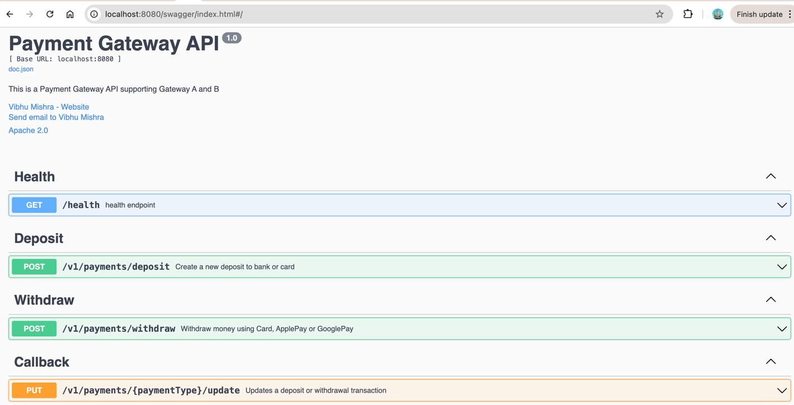

# Payment Gateway Api
## High Level Overview of Architecture
- Domain Driven Design followed
- AES encryption used for encrypting sensitive data in DB
- Circuit Breaker and Retry used with configurable settings
- Generic http and tcp clients modules created for reusability
- Generic json and soap modules formatters created for reusability
- DB migrations are used for creating tables in container
- Wiremock used for mocking Gateway A and B
- Slog used with excluding sensitive details from the logging
- Swagger added for endpoint documentation
- Makefile added for simplifying the build steps
- Docker compose added 
- ISO standard country and currency codes are used for making api aligned with the global standard

## Steps to run the project
**Step 1:** Make sure docker installed in your machine   
**Step 2:** Clone the project   
**Step 3:** run> cd PaymentGateway  
**Step 4:** run> sudo make start-components  
#### For stopping the containers
**Step 5:** run> sudo make stop-components 

## Swagger Url
**http://localhost:8080/swagger/index.html**

## Steps to run the tests
**Step 1:** run> cd PaymentGateway  
**Step 2:** run> go test ./...
## Development Assumptions
- Solution designed by considering that Gateways will be country-wise
  but implementation is flexible to change.
- Some tests in withdraw service and gateway are missing due to brevity.
- JWT auth not added by assuming that in real world application, there 
  will be central authentication service so this solution is focusing on 
  integration part of the problem.

## Future Improvements
- Adding idempotency to endpoints for handing duplicate requests causing extra charge to the customer
- Adding customer level locking in Withdraw for handling over-draft cases
- Adding alternative payment gateway as fallback in circuit breaker for improving the resiliency of the solution if one gateway down.